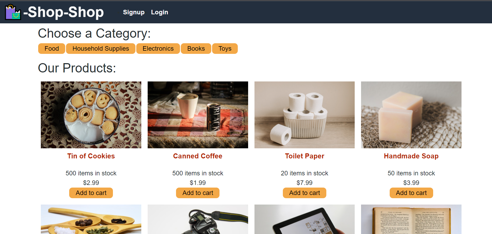

# Redux Store

## Table of contents
* [Redux Store Link](https://shop-shop-redux-store.herokuapp.com/)
* [General info](#general-info)
* [Technologies](#technologies)
* [Installation](#installation)

## General info
This is the sister application of the shop-hop webpage built in the module. This site has been refactored to use Redux instead of React.

## Technologies
Project is created with (all through VScode extension):
* CSS
* JavaScript
* React-Redux
* Redux
	
## Installation

Installation is fairly simple. All you have to do is clone the repository and run npm install in the terminal to download all the dependencies, including react-redux and redux package. After installing all the dependencies, run 'npm run develop' to run the application.

